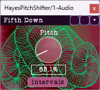

# HayesPitchShifter
A free, open-source pitch shifter audio plug-in that provides up to one octave up or down, and uses a phase vocoder to achieve the shift. 
It can be run in interval mode, which snaps to equal temperament intervals, or simply tune the signal by some percentage between 50% and 200%.

